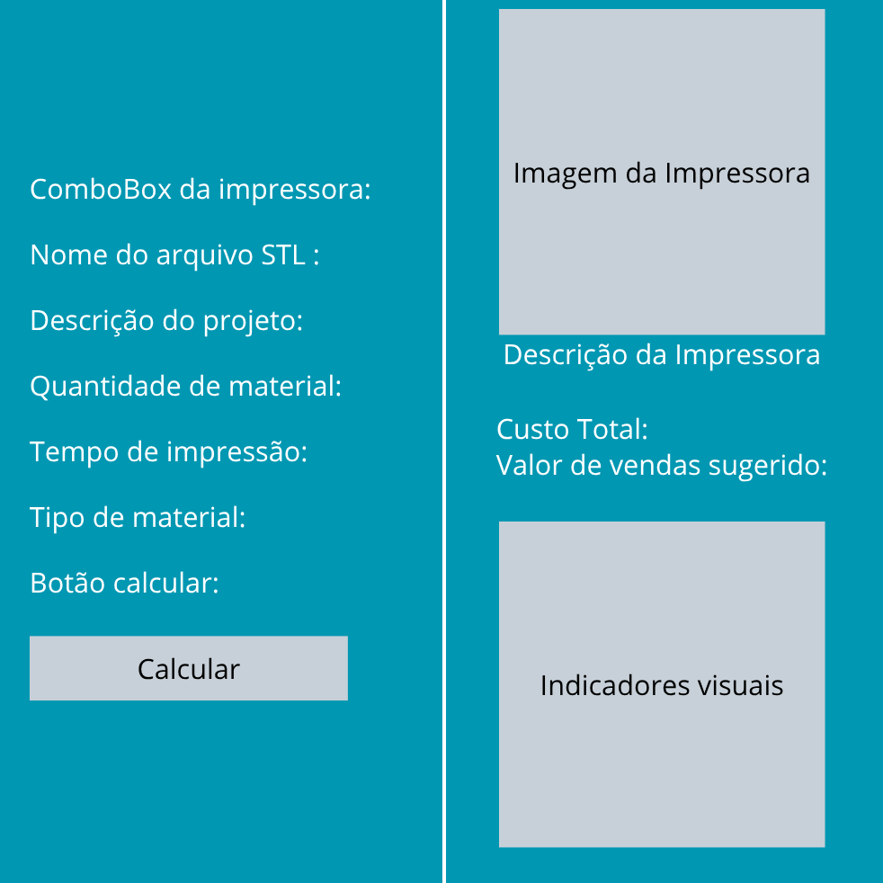

# Impressão 3D

Sistema desenvolvido em JavaFX para auxiliar no cálculo de custos de projetos de impressão 3D. A aplicação permite selecionar diferentes modelos de impressoras e tipos de materiais, informando dados como tempo de impressão e quantidade de material utilizado.

O sistema calcula automaticamente os custos de:

- Material utilizado;
- Consumo de energia elétrica;
- Depreciação da impressora;
- Mão de obra;
- Manutenção.

Ao final, é gerado um relatório com o custo total da impressão e uma sugestão de preço de venda, auxiliando na precificação de peças produzidas em impressoras 3D.

# Tecnologias

```markdown
- Java
- javaFX
```

# Front-End

Front-end desenvolvido utilizando somente HTML+CSS vanilla facilitando o entendimento do código para qualquer nivel de aprendizado, desenvolvido somente para demonstrar o propósito do projeto.

## Protótipo

Para melhor otimização do desenvolvimento do projeto, o protótipo abaixo foi desenvolvido para centralizar as ideias do grupo mostrando um fluxo entre os processos do código.



## Ferramentas

-  **Git** e **GitHub** - versionamento, trabalho colaborativo e hospedagem do projeto.
- **Visual Studio Code** - editor de código utilizado no desenvolvimento.

# Considerações Finais

Este projeto foi desenvolvido com o objetivo de aplicar na prática os conceitos estudados ao longo da disciplina de Estrutura de Dados, consolidando o entendimento sobre filas, manipulação do DOM e desenvolvimento de interfaces interativas.

Agradecemos ao professor **Carlos Henrique da Silva Santos** pela condução da disciplina, pela didática e pelo incentivo ao aprendizado prático.

## Autores

<table>
  <tr>
    <td align="center"><a href="https://github.com/andrwza"><br><sub>Andreza Damasceno</sub></a></td>
    <td align="center"><a href="https://github.com/Buenno0"><br><sub>Mateus Bueno</sub></a></td>
  </tr>
</table>
